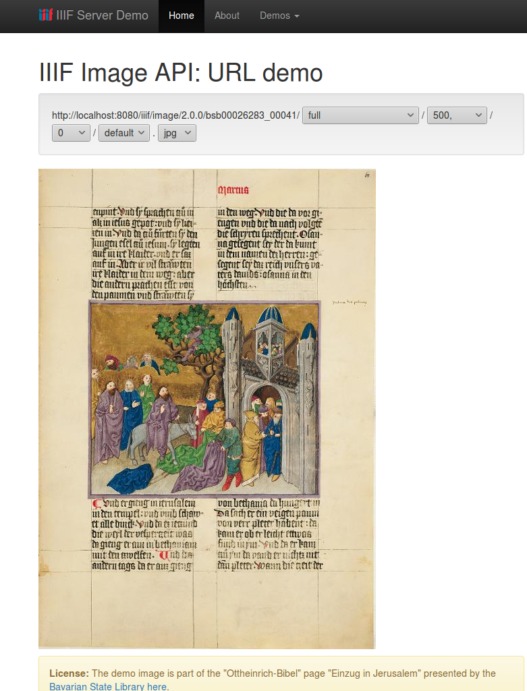
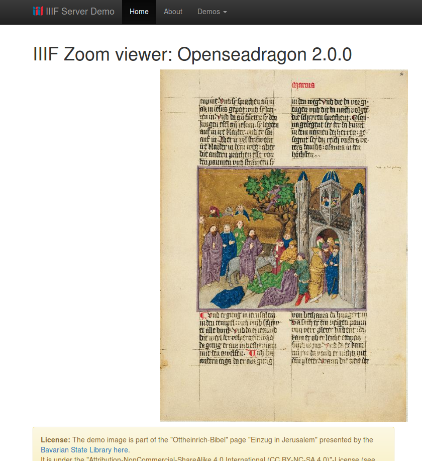
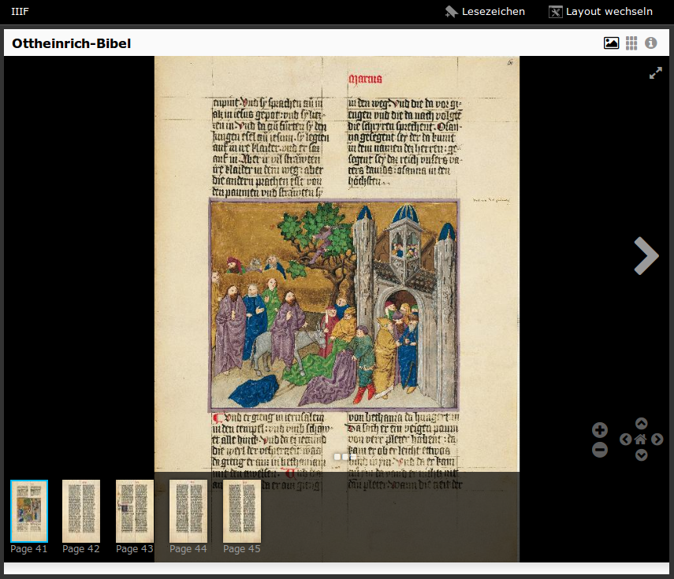

# IIIF Server Demo

[](https://travis-ci.org/dbmdz/iiif-server-demo)
[](LICENSE)
[](https://github.com/dbmdz/iiif-server-demo/releases)
[](https://www.codacy.com/app/ralf-eichinger/iiif-server-demo?utm_source=github.com&amp;utm_medium=referral&amp;utm_content=dbmdz/iiif-server-demo&amp;utm_campaign=Badge_Grade)
[](https://codecov.io/gh/dbmdz/iiif-server-demo)

A standalone IIIF server demonstrating the use of [IIIF Image API Java Libraries](https://github.com/dbmdz/iiif-image-api "IIIF Image API Java Libraries") and [IIIF Presentation API Java Libraries](https://github.com/dbmdz/iiif-presentation-api "IIIF Presentation API Java Libraries") (Java implementations of the [IIIF specifications](http://iiif.io/technical-details/ "IIIF specifications")).

## Run Demo Server

- Download iiif-server-demo.jar from [Releases on GitHub](https://github.com/dbmdz/iiif-server-demo/releases)
- Start server: `$ java -jar iiif-server-demo.jar`
- View Homepage: [http://localhost:8080/](http://localhost:8080/)

## Build from source and run it

```shell
$ mvn package && java -jar target/iiif-server-demo.jar
```

## Screenshots

IIIF Image API URL Demo:



OpenSeadragon zoom viewer Demo:



Mirador presentation viewer Demo:



## About the Demo's architecture

The Demo IIIF server uses Spring Boot serving a Spring MVC + Thymeleaf-Templates webapplication.<br/>
(See <a href="https://spring.io/guides/gs/spring-boot/">https://spring.io/guides/gs/spring-boot/</a>.)

Images are resolved by the demo specific classpath-access and currently only can serve the images with the identifiers "bsb00026283_0004x" (only packaged images in the demo). But you also could extend the resolvers for HTTP- or File-Protocol in the properties-files.

## License of images

The demo images are part of the "Ottheinrich-Bibel" page "Einzug in Jerusalem" presented by the Bavarian State Library here: <a href="http://daten.digitale-sammlungen.de/bsb00026283/image_41">http://daten.digitale-sammlungen.de/bsb00026283/image_41</a>.
They are under the "Attribution-NonCommercial-ShareAlike 4.0 International (CC BY-NC-SA 4.0)"-License (see <a href="http://creativecommons.org/licenses/by-nc-sa/4.0/">http://creativecommons.org/licenses/by-nc-sa/4.0/</a>)